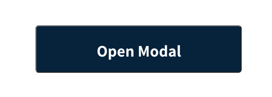
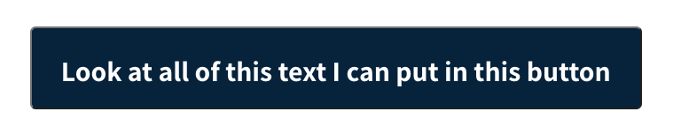
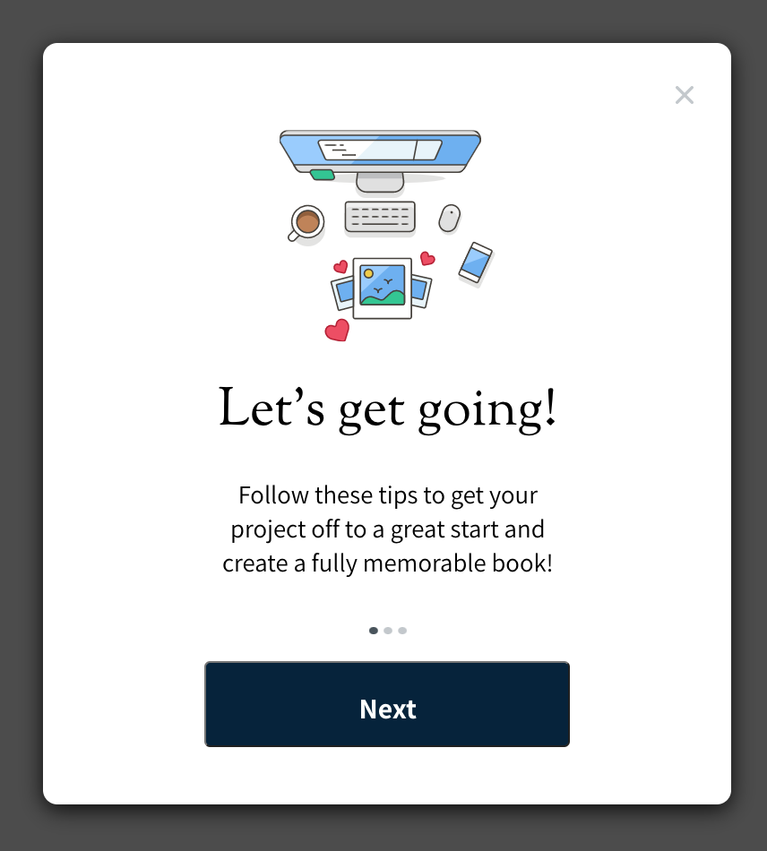
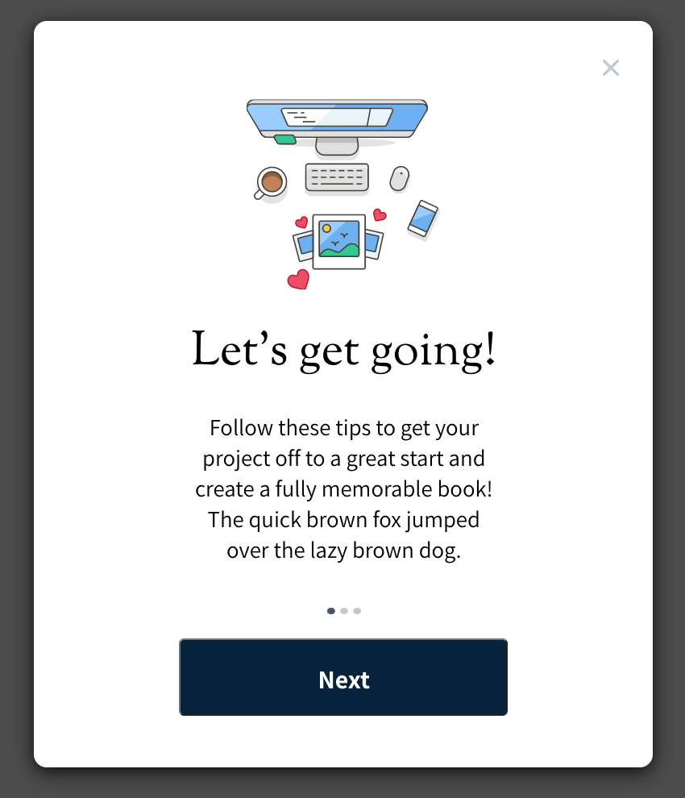

# Jason Toups - FrontEnd Assessment for Newlywords

The exercise called for creating a button and opening a modal.

Here is the [Figma Mockup](https://www.figma.com/file/FEz10wy2GzzAsTJ7aVfvgZ/Newlywords-Modal-Mockup) that was provided.

## UX

The user clicks the **Open Modal** button, then a _Modal_ appears.

When the user clicks the **close** button, the Modal should _disappear_.

Also, if the user clicks outside of the Modal, the Modal should disappear. The prototype did not include this interaction, but it follows modal best practices, so I included this.

Here is the [Figma Prototype](https://www.figma.com/proto/FEz10wy2GzzAsTJ7aVfvgZ/Newlywords-Modal-Mockup?scaling=min-zoom&node-id=1%3A134)

## Button



Since I used React for the exercise, I decided to use a _reusable_ **Button** component to open the Modal, and for the Next button on the modal.

```javascript
const Button = ({ text, onClick }) => {
  return (
    <button className='button' onClick={onClick}>
      {text}
    </button>
  );
};
```

I passed props into the Button for the text displayed inside the button.

I'm also passing an onClick prop, so the button can be reused for different events. When using the Button component, pass an onClick function into the prop, and the Button will call that function when it has been clicked.

```javascript
<Button text='Open Modal' onClick={() => setShow(!show)} />
```

To style the button, I used the google font [Assistant](https://fonts.google.com/specimen/Assistant) as showin in the mockup.

Since I wanted this button to be reuseable, I set the min-width to the width of the button in the mockup.

This way the Button component would _accommodate any amount of text_ shown within.



## Modal



I took the same reusable approach for the Modal componant as I did for the Button componant, by passing props into the component, this can be reused across the site.

```javascript
const Modal = ({ modalGraphic, header, body, buttonText, close }) => {
  return (
    <div className='modal'>
      
      
      <h1>{header}</h1>
      <p>{body}</p>
      
      <br />
      <div className='modal-button'>
        <Button text={buttonText} />
      </div>
    </div>
  );
};
```

Since the only interaction needed for this modal is to close it, I included a _close_ prop that can be used to close the modal.

I _did not include_ a Button onClick parameter, since the prototype did not call for it. But something I would add to the Modal, would be to either pass a child Button component into it, or to pass an onClick parameter into the Modal.

In the App.js file, here's the show ternary operator that shows the Modal if show in state is set to true.

```javascript
{
  show ? (
    <div className='modal-background'>
      <Modal
        modalGraphic={modalGraphic}
        header="Let's get going!"
        body='Follow these tips to get your project off to a great start and create a
        fully memorable book!'
        buttonText='Next'
        close={() => setShow(!show)}
      />
    </div>
  ) : null;
}
```

When styling the Modal, I used min-height, so that if the text in the body exceeds the three lines shown in the mockup, the modal will grow vertically to accommodate the text.



I _exported the graphics_ from the mockup as **.svg**, and included them in the project for the **close** icon, the modal **graphic** and the modal **dots**.

---

## Running the Project

I used Create React App, so just clone the repo, and run:

```
yarn start
```

The project will run on [http://localhost:3000/](http://localhost:3000/)

To create a build:

```
yarn build
```

To run the build from the build folder:

```
yarn global add serve
serve -s build
```

The build will run on [http://localhost:5000](http://localhost:5000)

---

# Contact

You can find me on [LinkedIn](https://www.linkedin.com/in/jasontoups/).

Take a look at my [portfolio](https://jasontoups.github.io/) to see some examples of my work.

Checkout my [GitHub profile](https://github.com/JasonToups) to see what I've been working on recently.

If you would like to see my work history, here is my [resume](https://docs.google.com/document/d/1koaqjOgaks8QpRmC1oR1Wt6XSJJ_Woj40uLOFUwXjzA/edit?usp=sharing).
